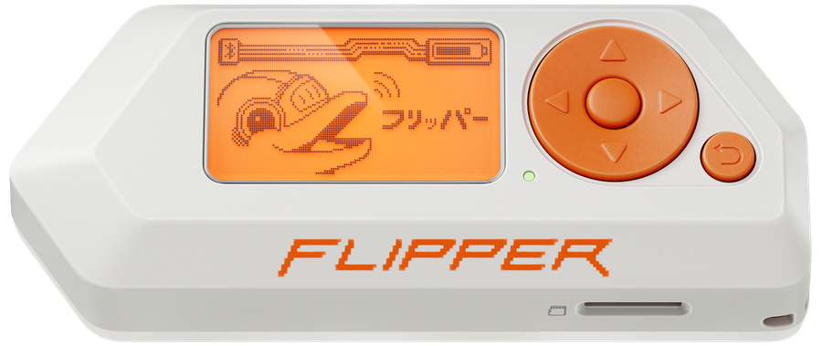

<h1 align="center">link</h1>

<p align="center">
  
</p>

<p align="center"><b>USB MIDI clock. On a Flipper.</b></p>

<p align="center">Plug it in. Your Mac sees <b>Link</b>. Start, clock, stop.</p>

<p align="center">
  
</p>

## Install

Official firmware. Apps → **GPIO → Link**.

```bash
just sdk
just build
just launch          # quit qFlipper first
```

Or drop `dist/link.fap` on the SD card at `apps/GPIO/`.

<p align="center">
  
  
  
</p>

## Modes

| Mode | What it does |
|------|----------------|
| SLAVE | MIDI clock in. GPIO CLK out. |
| MASTER | GPIO CLK in. MIDI clock out. |
| TAP | Internal clock. Unplug USB. |

Plug USB, pick SLAVE, hit play in the DAW. The gadget is named **Link** (Obedience Corp).

## Buttons

| | |
|--|--|
| Left / Right | Mode |
| OK | Start / stop |
| Up / Down | TAP: BPM. SLAVE: divide |
| Hold Back | Pinout |
| Back | Exit. USB comes back. |

MIDI channel 16: 48 start, 49 stop, 50–53 divide.

## GPIO

CLK / SI / SO on the 13-pin GPIO. Default Original (PB2 / PC3 / PB3). Hold **Back** for MLVK25 (PB3 / PA6 / PA7).

<p align="center">
  
</p>

## License

Apache 2.0.

Clock grammar follows [ArduinoBoy](https://github.com/trash80/Arduinoboy) modes 1 and 2 (GPL-2.0) as a spec. This tree is a new implementation.

Flipper Zero photo: [Flipper Devices](https://flipper.net/products/flipper-zero).

---

Built with [Festival](https://fest.build)
