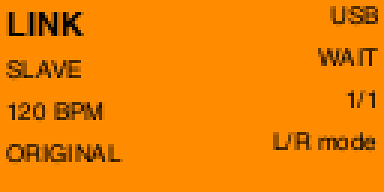
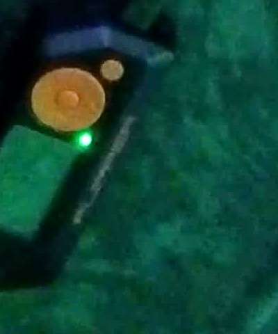
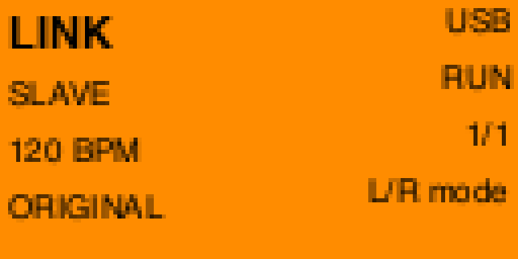
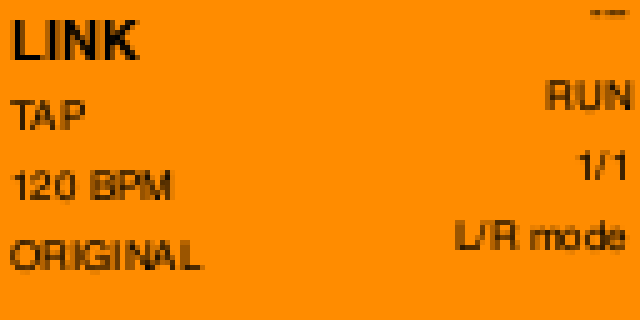
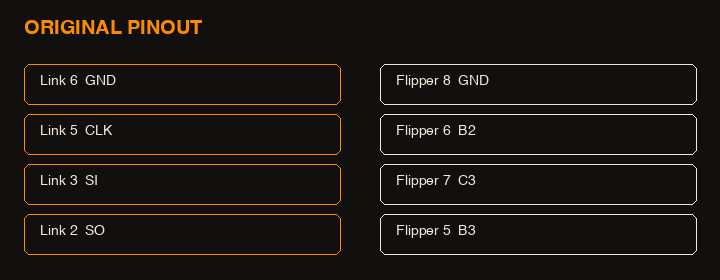

<h1 align="center">link</h1>

<p align="center">
  
</p>

<p align="center"><b>MIDI clock for a Game Boy. In your pocket.</b></p>

<p align="center">USB MIDI in. GPIO out. LSDJ follows.</p>

<p align="center">
  
</p>

## Install

Official firmware. Apps → **GPIO → Link**.

```bash
just sdk
just build
just launch          # quit qFlipper first
```

Or drop `dist/link.fap` on the SD card at `apps/GPIO/`.

<p align="center">
  
  
  
</p>

## Modes

| Mode | LSDJ `sync` | What it does |
|------|-------------|--------------|
| SLAVE | `Slave` | DAW clock in, eight CLK edges per tick |
| MASTER | `Master` | Game Boy clock in, MIDI clock out |
| TAP | `Slave` | Internal clock. Unplug USB. |

Groove **6 ticks/step**. Start on LSDJ so it says WAIT, then hit play on the DAW.

## Kit

- Flipper Zero
- [KBEmbedded GB Link](https://www.tindie.com/products/kbembedded/game-link-gpio-module-for-flipper-zero-game-boy/) (or a cable you continuity-checked)
- Game Boy Color, GBA SP, or Analogue Pocket
- LSDJ from [littlesounddj.com](https://www.littlesounddj.com). Not in this repo.

<p align="center">
  
</p>

Hold **Back** for MLVK25. Original DMG is 5 V. Untested.

## Buttons

| | |
|--|--|
| Left / Right | Mode |
| OK | Start / stop |
| Up / Down | TAP: BPM. SLAVE: divide |
| Hold Back | Pinout |
| Back | Exit. USB comes back. |

MIDI channel 16: 48 start, 49 stop, 50–53 divide.

## License

Apache 2.0.

Clock follows [ArduinoBoy](https://github.com/trash80/Arduinoboy) modes 1 and 2 (GPL-2.0) as a spec. This tree is a new implementation. Pinout follows KBEmbedded. LSDJ is © Johan Kotlinski.

---

Built with [Festival](https://fest.build)
